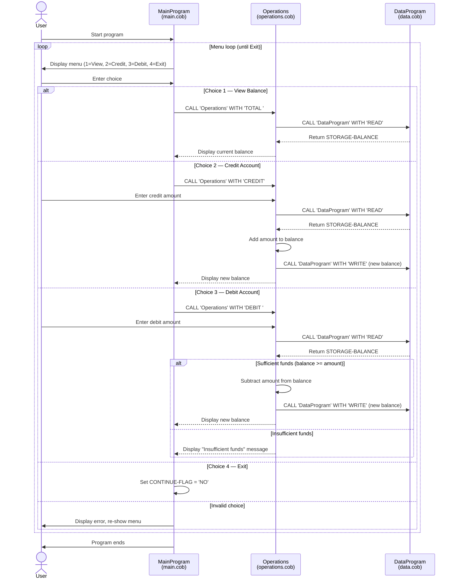

# Student Account Management System — COBOL Documentation

This document describes the purpose, key functions, and business rules for each COBOL source file in the `src/cobol/` directory.

---

## Overview

The application is a command-line **Account Management System** that allows users to view a student account balance, credit funds, and debit funds. It is composed of three COBOL programs that interact through `CALL` statements.

```
main.cob  →  operations.cob  →  data.cob
```

---

## Files

### `main.cob` — MainProgram

**Purpose:**  
Entry point of the application. Presents an interactive menu to the user and dispatches to the `Operations` program based on the selected action.

**Key Logic:**
- Displays a numbered menu (View Balance, Credit Account, Debit Account, Exit) in a loop.
- Accepts a single-digit choice (1–4) from the user via `ACCEPT`.
- Uses `EVALUATE` to route each choice:
  - `1` → calls `Operations` with `'TOTAL '` to display the current balance.
  - `2` → calls `Operations` with `'CREDIT'` to add funds.
  - `3` → calls `Operations` with `'DEBIT '` to withdraw funds.
  - `4` → sets `CONTINUE-FLAG` to `'NO'`, terminating the loop and exiting.
- Any other input displays an error message and re-displays the menu.

**Business Rules:**
- The menu loop continues until the user explicitly chooses option 4 (Exit).
- Invalid menu choices do not terminate the program; they prompt the user to try again.

---

### `operations.cob` — Operations

**Purpose:**  
Handles the business logic for each account operation. Called by `MainProgram` with a 6-character operation code. Delegates balance persistence to `DataProgram`.

**Key Logic:**
- Receives `PASSED-OPERATION` (`PIC X(6)`) via the `LINKAGE SECTION`.
- Branches on the operation type:
  - **`TOTAL `** — reads the current balance from `DataProgram` and displays it.
  - **`CREDIT`** — prompts for an amount, reads the current balance, adds the amount, writes the new balance, and displays it.
  - **`DEBIT `** — prompts for an amount, reads the current balance, checks for sufficient funds, subtracts the amount if allowed, writes the new balance, and displays it; otherwise displays an insufficient-funds message.
- Returns to the caller with `GOBACK`.

**Data Fields:**
| Field | Picture | Initial Value | Description |
|---|---|---|---|
| `OPERATION-TYPE` | `PIC X(6)` | — | Local copy of the passed operation code |
| `AMOUNT` | `PIC 9(6)V99` | — | Amount entered by the user |
| `FINAL-BALANCE` | `PIC 9(6)V99` | `1000.00` | Working copy of the account balance |

**Business Rules:**
- A debit is only processed when `FINAL-BALANCE >= AMOUNT`; otherwise the transaction is rejected with an "Insufficient funds" message.
- The balance is always re-read from `DataProgram` before any modification, ensuring the working copy is current.
- The initial value of `FINAL-BALANCE` (`1000.00`) acts as a fallback default if no persisted balance exists yet.

---

### `data.cob` — DataProgram

**Purpose:**  
Provides in-memory persistence for the account balance. Acts as a simple data layer called by `Operations` to read or write the balance.

**Key Logic:**
- Receives `PASSED-OPERATION` (`PIC X(6)`) and `BALANCE` (`PIC 9(6)V99`) via the `LINKAGE SECTION`.
- Branches on the operation type:
  - **`READ`** — copies `STORAGE-BALANCE` into the caller-supplied `BALANCE` field.
  - **`WRITE`** — copies the caller-supplied `BALANCE` field into `STORAGE-BALANCE`.
- Returns to the caller with `GOBACK`.

**Data Fields:**
| Field | Picture | Initial Value | Description |
|---|---|---|---|
| `STORAGE-BALANCE` | `PIC 9(6)V99` | `1000.00` | Persisted (in-memory) account balance |
| `OPERATION-TYPE` | `PIC X(6)` | — | Local copy of the passed operation code |

**Business Rules:**
- The account starts with a default balance of **$1,000.00**.
- Balance is stored in-memory only; it resets to the default value each time the program is restarted (no file or database persistence).
- The maximum storable balance is `999999.99` (six digits before the decimal, two after), enforced by the `PIC 9(6)V99` picture clause.

---

## Business Rules Summary

| Rule | Location |
|---|---|
| Starting account balance is $1,000.00 | `data.cob` — `STORAGE-BALANCE` initial value |
| Balance resets on program restart (no persistent storage) | `data.cob` — in-memory only |
| Debits are rejected if balance is insufficient | `operations.cob` — `IF FINAL-BALANCE >= AMOUNT` |
| Maximum balance / transaction amount is $999,999.99 | All files — `PIC 9(6)V99` picture clause |
| Menu loops until user selects Exit (option 4) | `main.cob` — `PERFORM UNTIL CONTINUE-FLAG = 'NO'` |
| Invalid menu choices are handled gracefully | `main.cob` — `WHEN OTHER` in `EVALUATE` |

---

## Sequence Diagram


